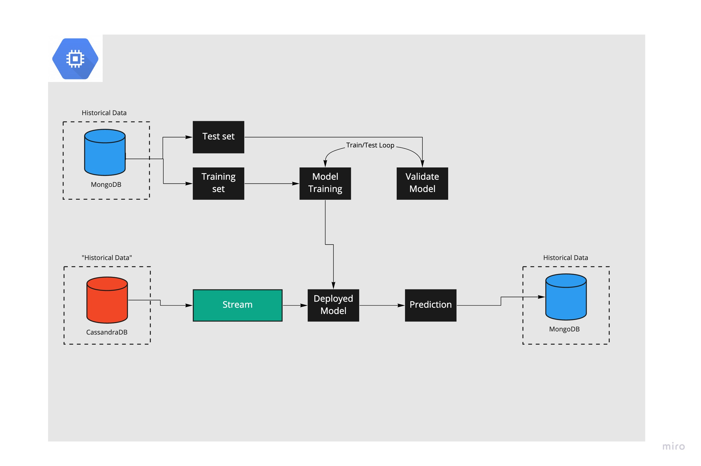

# CS2020-OST-SM :construction: 
CS2020-OST-SM application
<ul>Participants:
<li>Ahmad Abdelrahim -- user-1</li>
<li>Bashar Khdr -- user-2</li>
<li>Georgie Kalaygie -- user-3</li>
<li>Tasnime Ayed -- user-4</li>
<li>Ekaterina Zolotareva -- user-5</li>
<li>Maksim Kumundzhiev -- user-6</li>
</ul>

Each member has dedicated git branch to work on with corresponding name.

## Kick off
```bash
$ mkdir ost-sm && cd ost-sm
$ git clone https://github.com/KumundzhievMaxim/CS2020-OST-SM.git && cd CS2020-OST-SM
$ git checkout user-{your_number}

## Hints 
1. do not forget frequently fetch updates from master branch if there are such.   
2. do more commits approaching your task. 
  use foolowing format of commiting changes:
  $ git commit -m 'user-{your_number}, {what"s done}'

4. do more PRs approaching your task.
  - write explicit description of PR;
  - assign yourself for pushing PR;
  - add reviewers (your teammembers) for PR;
  - DO NOT merge PR until at least one of teammembers will not review it;  

5. keep code clean and readable for other teammembers. 
```


## Application Description
### Application Propose
The application propose is the provision of 3 classification pre-trained on real-world data models which enables to predict 3 different types of targets.

### Application Structure
The application assumed to be deployed onto the dedicated GCP instance, jointly the application will provide finite number of endpoints to trigger dedicated parts of the application by api.      

**The application is splitted on dedicated independent microservices** 
<br>
Each and every microservice is independently deployable.
<br>
Communicates between microservices operates based on interface of each microservice.

<ul>
Microservices:
  <li>ml-kit microservice</li>
  <li>spark microservice</li>
  <li>flink microservice</li>
  <li>mongodb microservice</li>
  <li>cassandra microservice</li>
</ul>

### Routines


# Application High-Level Diagram 
 
 
 

# Data Description
The project data source is [NetML Challenge 2020](https://github.com/ACANETS/NetML-Competition2020)
- Data is represented as the collection of  `1,199,139 flows` in spreaded across `3 different datasets` (including detailed flow features and labels.)
    - NetML
      NetML dataset is constructed by selecting several PCAP files from www.stratosphereips.org website.
    - CICIDS2017
      CICIDS2017 dataset is generated using https://www.unb.ca/cic/datasets/ids-2017.html
    - non-vpn2016
       non-vpn2016 dataset is the subset of ISCX-VPN-nonVPN2016 dataset from https://www.unb.ca/cic/datasets/vpn.html
       Detailed description can be found at: [NetML: A Challenge for Network Traffic Analytics](https://arxiv.org/abs/2004.13006)


# Cloud Engine
### Engine Characteristics
|Name           |Zone             |Internal IP  |External IP  |Connect |OS Type
|---            |---              |---          |---          |---     |---    
|ost-sm-instance|europe-west2-c   |10.154.0.2   |10.154.0.2   |SSH     |Ubuntu

The assumed environment provider: **conda**
- **conda** is already preinstalled on the Cloud Enginer by administartor.
- **docker** is already preinstalled on the Cloud Enginer by administartor. 

### Connect to Cloud Engine
**Once you need to get access to the GCP instance**:
1. prepare your public key
Copy content of:
```bash
$ cat ~/.ssh/id_rsa.pub
```
2. contact the administrator 

#### Using native Terminal and SSH client  
```bash
$ ssh username@instance-ip-address
e.g.:
$ ssh macbook@35.246.102.21 
``` 

#### Using Cloud Console
In the list of virtual machine instances, click SSH in the row of the instance that you want to connect to.
After you connect, you can use the terminal to run commands on your Linux instance. When you are done, use the exit command to disconnect from the instance.

#### Using gcloud SDK
```bash
$ gcloud compute ssh INTERNAL_INSTANCE_NAME --zone=ZONE --internal-ip
e.g.:
$ gcloud beta compute ssh --zone "europe-west2-c" "ost-sm-instance" --project "dazzling-task-267622"
``` 

**It is highly recommended to create dedicated conda environment for yourself.**    
```bash
$ conda create -n {environment_name} python=3.8 -y && conda activate {environment_name}
$ pip install -r reqirements.txt 
```
     