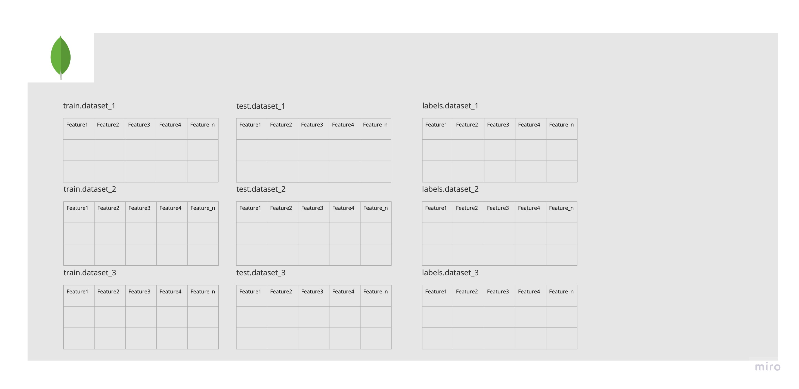

# CS2020-OST-SM :construction: 
CS2020-OST-SM application
<ul>Participants:
<li>Ahmad Abdelrahim -- user-1</li>
<li>Bashar Khdr -- user-2</li>
<li>Georgie Kalaygie -- user-3</li>
<li>Tasnime Ayed -- user-4</li>
<li>Ekaterina Zolotareva -- user-5</li>
<li>Maksim Kumundzhiev -- user-6</li>
</ul>

Each member has dedicated git branch to work on with corresponding name.

## Kick off
```bash
$ mkdir ost-sm && cd ost-sm
$ git clone https://github.com/KumundzhievMaxim/CS2020-OST-SM.git && cd CS2020-OST-SM
$ git checkout user-{your_number}

## Hints 
1. do not forget frequently fetch updates from master branch if there are such.   
2. do more commits approaching your task. 
  use foolowing format of commiting changes:
  $ git commit -m 'user-{your_number}, {what"s done}'

4. do more PRs approaching your task.
  - write explicit description of PR;
  - assign yourself for pushing PR;
  - add reviewers (your teammembers) for PR;
  - DO NOT merge PR until at least one of teammembers will not review it;  

5. keep code clean and readable for other teammembers. 
```


## Application Description
### Application Propose
The application propose is the provision of 3 classification pre-trained on real-world data models which enables to predict 3 different types of targets.

### Application Structure
The application assumed to be deployed onto the dedicated GCP instance, jointly the application will provide finite number of endpoints to trigger dedicated parts of the application by api.      

**The application is splitted on dedicated independent microservices** 
<br>
Each and every microservice is independently deployable.
<br>
Communicates between microservices operates based on interface of each microservice.

<ul>
Microservices:
  <li>ml-kit microservice</li>
  <li>spark microservice</li>
  <li>flink microservice</li>
  <li>mongodb microservice</li>
</ul>

## api 
API and the Extensible Service Proxy (ESP) run in prebuilt Docker containers on GCP Compute Engine.

## ml-kit microservice
TBD

## spark microservice
TBD

## flink microservice
TBD

## mongodb microservice
TBD

# Application High-Level Diagram 
 
# MongoDB Tables Schema
 


# Data Description
The project data source is [NetML Challenge 2020](https://github.com/ACANETS/NetML-Competition2020)
- Data is represented as the collection of  `1,199,139 flows` in spreaded across `3 different datasets` (including detailed flow features and labels.)
    - NetML
      NetML dataset is constructed by selecting several PCAP files from www.stratosphereips.org website.
    - CICIDS2017
      CICIDS2017 dataset is generated using https://www.unb.ca/cic/datasets/ids-2017.html
    - non-vpn2016
       non-vpn2016 dataset is the subset of ISCX-VPN-nonVPN2016 dataset from https://www.unb.ca/cic/datasets/vpn.html
       Detailed description can be found at: [NetML: A Challenge for Network Traffic Analytics](https://arxiv.org/abs/2004.13006)


# Cloud Engine
The assumed environment provider: **conda**
- **conda** is already preinstalled on the Cloud Enginer by administartor.
- **docker** is already preinstalled on the Cloud Enginer by administartor. 

### Connect to Cloud Engine
```bash
$ ssh username@instance-ip-address
> Enter password
``` 

### Connect to running Docker Container on Cloud Engine
```bash
$ docker exec -it {DOCKER CONTAINER ID} bash
``` 


**It is higly reccomned to create dedicated conda environment for yourself.**    
```bash
$ conda create -n {environment_name} python=3.8 -y && conda activate {environment_name}
$ pip install -r reqirements.txt 
```     


# Deployment
 :information_source: under process
```bash
$ 
```

#### MongoDB deployment
```bash
$ 
```

#### ML-KIT deployment
```bash
$ 
```

#### Spark deployment
```bash
$ 
```

#### Flink deployment
```bash
$ 
```
