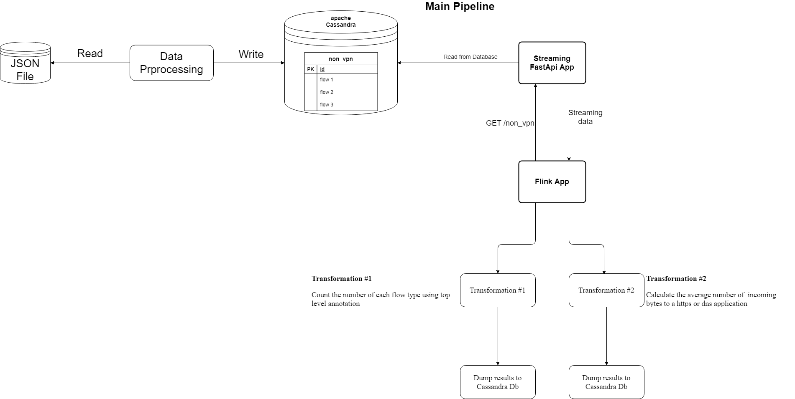

# Streaming Pipeline for Non-vpn2016 Using Cassandra Database as a storage and flink as streaming environment



## The system comprises the following components

#### Cassandra Database instance
#### RESTful api micro service that streams the data using a generator
#### flink application has a custom data source that reads the data from the streaming api and transforms it into a JSON Object</li>

## Inside the flink application. We performed the following two transformations

### First transformation counts the number of each data flow type (chat, P2P,...)

### Second transformation calculates the average # of incoming bytes to a http or dns app in a time window of 5 seconds. It has two processing steps

#### It filters the incoming flows based on destination port number, and keep only http and dns related flows
#### It applies a Time windowing aggregation to calculate the avg # of incoming bytes during 5 seconds

### The results of both transformations are dumped to a Cassandra Database sink for further processing...

## How to run the demo

#### Please refer to CassandraDb folder for instructions on how to install apache cassandra

#### The data is being served from a streaming microservice inside api folder

#### inside a terminal, install the following packages (It is highly recommended to create an isolated conda environment for that)

```
  pip install uvicorn fastapi cassandra-driver
```
#### inside the microservice streaming service:

```
  uvicorn main:app --reload --port preferred-port-number (optional)
```
#### Note that for performance enhancement. The data is being loaded from Cassandra Database into memory (to avoid slow hard disk I/O later) when the application starts. In this way, you have to statically define the partitions names from which the data will be served inside the streaming api main file.

#### open the flink app inside your favourite IDE (Intellij is highly recommended)

#### make sure you have a valid Java Development Kit installed on your machine

#### Run the main Java Class

#### The results will be dumped to a Cassandra Sink
